# OBTARA Web — Workflow Specification

| Atribut         | Nilai                                     |
| --------------- | ----------------------------------------- |
| Versi           | 0.3 — Personal-first revision             |
| Status          | Draft untuk validasi                      |
| Tanggal         | 31 Juli 2026                              |
| Dokumen terkait | [Product Requirements Document](./prd.md) |

## 1. Tujuan dokumen

Dokumen ini menjelaskan alur OBTARA sebagai responsive web app personal-first dengan PWA opsional. Workflow menjadi acuan product design, frontend, backend, QA, support, dan analitik.

Fokus utama versi web:

- Pengguna dapat mengatur obat untuk dirinya sendiri tanpa membuat keluarga atau caregiver.
- Profil “Saya” menjadi default di seluruh alur inti.
- Dukungan caregiver tersedia sebagai modul opsional setelah diaktifkan pemilik profil.
- Service worker meningkatkan pengalaman offline dan push jika didukung.
- Backend menjadi sumber kebenaran jadwal, reminder, alert, dan audit.
- Browser capability dan permission selalu diperiksa sebelum mengaktifkan fitur tambahan.

## 2. Aktor dan komponen

### 2.1 Aktor

| Aktor                       | Deskripsi                                                                    |
| --------------------------- | ---------------------------------------------------------------------------- |
| Pengguna pribadi            | Individu yang mempunyai jadwal obat dan memakai OBTARA untuk dirinya sendiri |
| Pemilik profil              | Pengguna pribadi; pemegang otoritas utama dan consent secara default         |
| Pengelola profil opsional   | Pihak yang diberi hak setelah modul dukungan keluarga diaktifkan             |
| Caregiver utama opsional    | Penerima eskalasi pertama setelah diundang dan diberi izin                   |
| Caregiver cadangan opsional | Penerima eskalasi lanjutan jika aturan opsional diaktifkan                   |

### 2.2 Komponen teknis

| Komponen           | Tanggung jawab                                                 |
| ------------------ | -------------------------------------------------------------- |
| React UI           | Render layar, input, validasi, dan interaksi                   |
| Vite build         | Dev server dan produksi asset frontend                         |
| Browser            | Menyediakan DOM, permission, camera, storage, dan network      |
| Service worker     | App shell, cache aman, push handler, dan background capability |
| IndexedDB          | Event offline dan cache lokal yang terkontrol                  |
| Backend API        | Data profil, obat, jadwal, stok, membership, dan audit         |
| Scheduler          | Membuat dan mengevaluasi reminder/alert berdasarkan timezone   |
| Push provider      | Mengantar Web Push ke pengguna dan caregiver opsional          |
| Email/SMS provider | Kanal fallback sesuai consent                                  |
| Object storage     | Foto privat dengan signed URL                                  |

## 3. Arsitektur alur tingkat tinggi

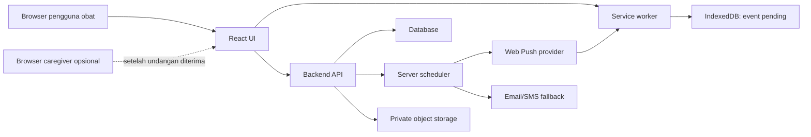

### Aturan sumber kebenaran

- Jadwal aktif berasal dari backend; permission caregiver hanya ada jika dukungan keluarga diaktifkan.
- Service worker tidak menjadi sumber kebenaran jadwal.
- IndexedDB hanya menyimpan event lokal yang belum tersinkron dan cache yang diizinkan.
- UI menampilkan umur data dan status sinkronisasi.
- Push yang gagal tidak mengubah status dosis.

### 3.1 Alur produk yang terlihat pengguna

Alur inti sengaja dibatasi agar dapat dipahami tanpa pengetahuan mengenai caregiver,
scheduler, atau sinkronisasi:

1. **Mulai untuk saya:** buat profil pribadi dan atur preferensi.
2. **Tambah obat:** masukkan identitas, foto opsional, jadwal, dan stok.
3. **Lihat Hari Ini:** temukan jadwal pribadi berdasarkan waktu.
4. **Catat status:** pilih Dikonfirmasi, Tunda, Lewati, atau Tidak Yakin.
5. **Tinjau:** lihat Obat Saya, stok, dan riwayat.
6. **Aktifkan bantuan bila perlu:** undang caregiver dari Pengaturan; langkah ini opsional dan berada di luar alur inti.

Navigasi default hanya berisi Hari Ini, Obat Saya, Stok, Riwayat, dan Pengaturan.
Kompleksitas backend tetap ada, tetapi tidak ditampilkan sebagai keputusan yang harus
dipahami pengguna pada penggunaan sehari-hari.

## 4. Model status global

### 4.1 Capability status browser

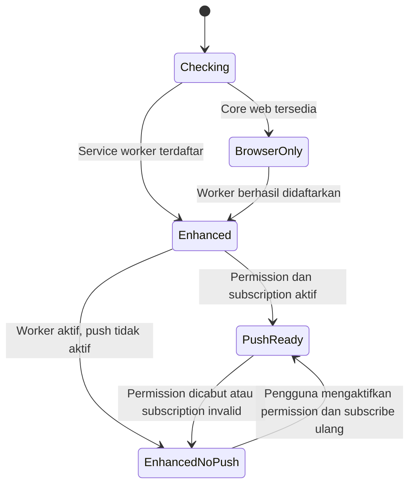

Status ini mengontrol enhancement, bukan akses terhadap fitur dasar.

### 4.2 Status sinkronisasi event

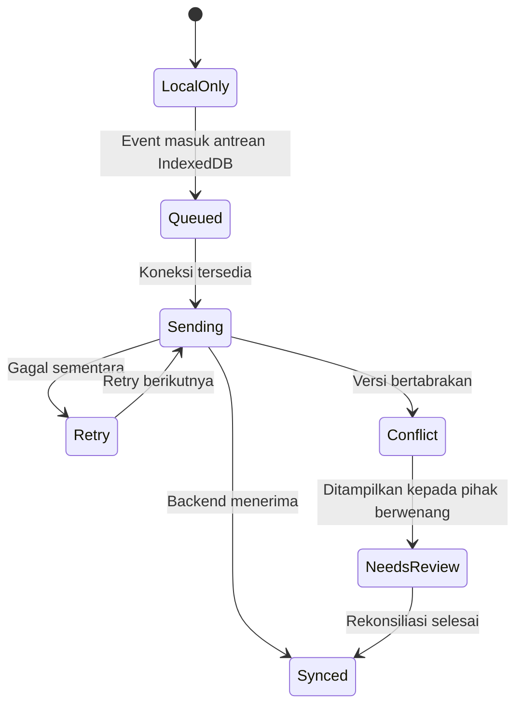

## 5. WF-W01 — First visit dan capability check

### Pemicu

Pengguna membuka domain OBTARA dari browser.

### Alur utama

1. Browser memuat HTML shell dan asset minimal.
2. React menampilkan loading state yang tidak membocorkan data privat.
3. Aplikasi memeriksa HTTPS, service worker, IndexedDB, Notification, Push, dan Camera.
4. Service worker didaftarkan bila tersedia.
5. Aplikasi menampilkan banner kemampuan:
   - “Bisa dipasang sebagai aplikasi” jika installability tersedia.
   - “Notifikasi browser tersedia” jika permission dapat diminta.
   - “Mode dasar browser aktif” jika enhancement tidak tersedia.
6. Pengguna dapat menutup banner dan melanjutkan.
7. Pengguna diarahkan ke login atau onboarding.

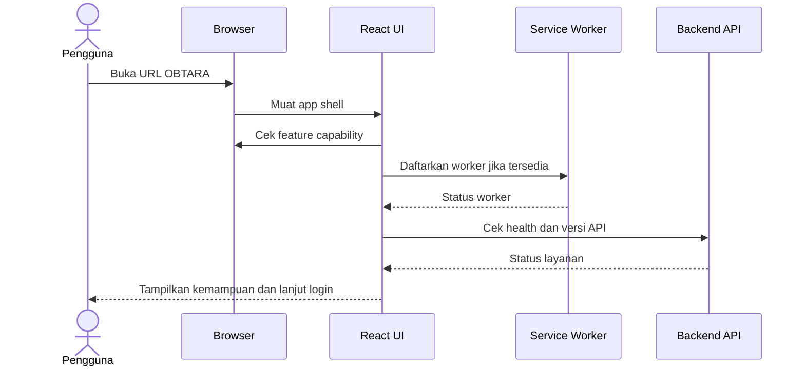

### Pengecualian

- Jika HTTPS tidak aktif di environment yang membutuhkan worker, aplikasi tetap dapat menampilkan core UI tetapi tidak mengaktifkan push/worker.
- Jika service worker gagal, aplikasi menyimpan status `BrowserOnly` dan tidak terus meminta permission.
- Jika API tidak tersedia, halaman status layanan ditampilkan tanpa menghapus data lokal.
- Jika browser tidak mendukung IndexedDB, event offline diberi fallback berupa status “perlu koneksi”.

### Hasil akhir

- Capability status tersimpan untuk sesi browser.
- Pengguna mengetahui batasan fitur sebelum mengaktifkan notifikasi.

## 6. WF-W02 — Login, onboarding, dan install prompt

### Alur utama

1. Pengguna memilih login/daftar.
2. Backend memvalidasi identitas dan membuat sesi aman.
3. Aplikasi menawarkan “Atur obat untuk saya” sebagai pilihan default dan membuat profil “Saya”.
4. Pengguna mengatur timezone, ukuran teks, kontras, dan suara/getaran bila tersedia.
5. Aplikasi menjelaskan beda antara reminder, konfirmasi, dan bukti konsumsi.
6. Aplikasi meminta permission notification hanya setelah manfaatnya dijelaskan.
7. Jika installability tersedia, tampilkan CTA install sebagai langkah opsional.
8. Pengguna diarahkan menambahkan obat pertama miliknya sendiri.
9. Undangan caregiver, bila ada, diproses melalui alur terpisah dan tidak mengubah onboarding pribadi menjadi wajib multi-profil.

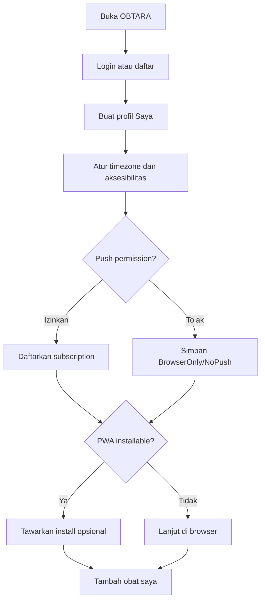

### Aturan permission

- Jangan meminta notification permission pada first paint tanpa konteks.
- Jika pengguna menolak, jangan meminta berulang pada setiap halaman.
- Tampilkan pengaturan permission dan fallback kanal di Settings.
- Permission bukan bukti bahwa notifikasi akan selalu tampil; tampilkan status subscription terakhir.
- Install PWA tidak boleh menjadi syarat untuk membuat profil.
- Pengguna tidak melihat family selector atau setup caregiver pada onboarding pribadi.
- Dukungan keluarga ditawarkan dari Pengaturan setelah pengguna memahami alur inti, bukan sebagai interupsi first-run.

## 7. WF-W03 — Menambahkan obat melalui browser

### Alur utama

1. Pengguna menekan “Tambah Obat” dari `/today`; popup formulir terbuka tanpa mengganti halaman.
2. Profil pemilik otomatis “Saya”; pemilih profil tidak muncul pada mode pribadi.
3. Masukkan nama, kekuatan, bentuk, dan jumlah penggunaan.
4. Pilih “Upload foto” atau “Ambil dengan kamera”.
5. Browser meminta permission kamera hanya setelah pengguna memilih opsi kamera.
6. Pengguna melihat preview, crop, rotate, dan retake.
7. Frontend mengompresi foto dan menghapus EXIF yang tidak diperlukan.
8. Backend mengunggah media ke storage privat.
9. Pengguna mengatur lokasi kabinet, jadwal, stok, dan ambang refill.
10. Pengguna meninjau ringkasan di dalam popup.
11. Backend menyimpan obat dan membentuk kejadian dosis masa depan.
12. Popup menutup dan `/today` menampilkan jadwal baru; tombol Batal, Tutup, atau Escape tidak menyimpan perubahan.

Pada prototype lokal saat ini, foto memakai preset demo, upload/kamera tetap nonaktif, dan
hasil form disimpan ke `localStorage`. Deep link lama `/medications/new` diarahkan ke
`/today` lalu membuka popup yang sama.

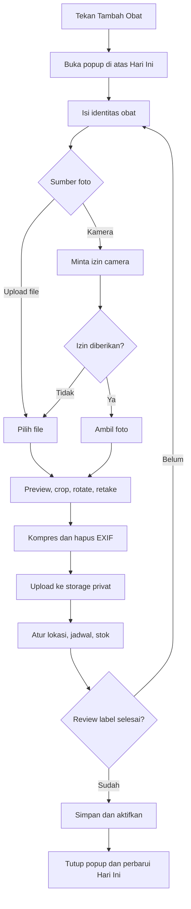

### Validasi web

- Upload gagal tidak menghapus data form.
- File yang terlalu besar diberi instruksi kompresi atau diproses otomatis.
- Browser tanpa camera capture tetap dapat menggunakan file picker.
- Foto tidak ditampilkan dari URL publik permanen.
- Jika pengguna melewati foto, kabinet menampilkan placeholder dan meminta foto di kemudian hari.
- Nama dan dosis harus tetap tersedia walaupun foto gagal diupload.

## 8. WF-W04 — Kabinet visual dan responsive layout

### Penggunaan pribadi pada mobile

1. Landing setelah login adalah `/today`.
2. Kartu dosis ditampilkan satu kolom.
3. Foto cukup besar untuk dibandingkan dengan obat fisik.
4. Detail dibuka sebagai halaman atau bottom sheet.
5. CTA utama berada di area yang mudah dijangkau ibu jari.
6. Navigasi utama menggunakan bottom navigation atau menu ringkas.

### Penggunaan pribadi pada desktop/tablet

1. Sidebar menampilkan Hari Ini, Obat Saya, Stok, Riwayat, dan Pengaturan.
2. Header menunjukkan satu profil aktif “Saya” dan label mode pribadi.
3. Panel utama menampilkan progres catatan serta jadwal hari ini.
4. Detail obat dibuka tanpa kehilangan konteks daftar.
5. Keyboard navigation dan focus ring selalu tersedia.

Dashboard beberapa profil hanya tersedia pada modul dukungan keluarga setelah undangan dan
izin aktif; dashboard tersebut bukan variasi default dari halaman pribadi.

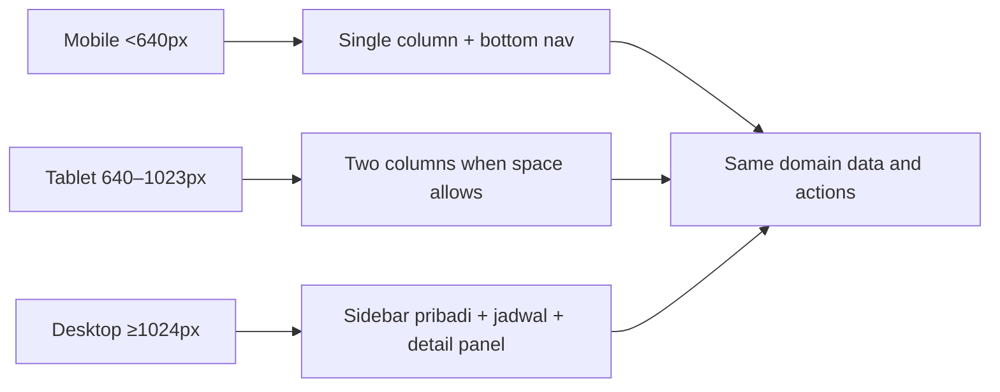

### Aturan visual

- Foto, nama, dosis, waktu, dan status selalu berdekatan.
- Warna tidak menjadi satu-satunya identitas.
- Status memiliki teks, ikon, dan aria-label.
- Foto dapat diperbesar tetapi tidak menghilangkan konteks nama/dosis.
- Tabel desktop memiliki alternatif kartu untuk layar kecil.

## 9. WF-W05 — Reminder web dan konfirmasi dosis

### Jalur reminder

1. Scheduler backend membaca jadwal aktif dan timezone profil.
2. Scheduler membuat `ReminderJob` untuk waktu target.
3. Backend menentukan kanal berdasarkan consent dan capability.
4. Jika push aktif, push dikirim ke service worker.
5. Service worker menampilkan notification.
6. Klik notification membuka URL dosis, misalnya `/today?dose=<id>`.
7. Jika push gagal atau tidak tersedia, fallback email/in-app digunakan sesuai kebijakan.
8. Pengguna membuka kartu visual dan memilih tindakan.

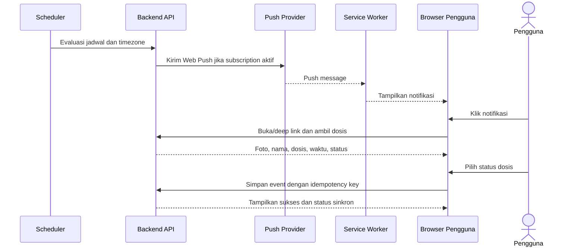

### Tindakan pengguna

- **Sudah digunakan:** simpan `Confirmed`, kurangi stok satu kali.
- **Ingatkan lagi:** tetap pada event yang sama, buat reminder ulang.
- **Lewati dosis:** simpan alasan, jangan kurangi stok.
- **Saya tidak yakin:** tahan tindakan tambahan dan tawarkan pemeriksaan instruksi atau bantuan orang tepercaya.

### Pencegahan dosis ganda

1. Pengguna membuka event dari dua tab.
2. Tab pertama menyimpan `Confirmed`.
3. Tab kedua meminta data terbaru atau menerima conflict response.
4. UI menampilkan bahwa event sudah memiliki konfirmasi.
5. Stok tidak berkurang untuk kedua kalinya.

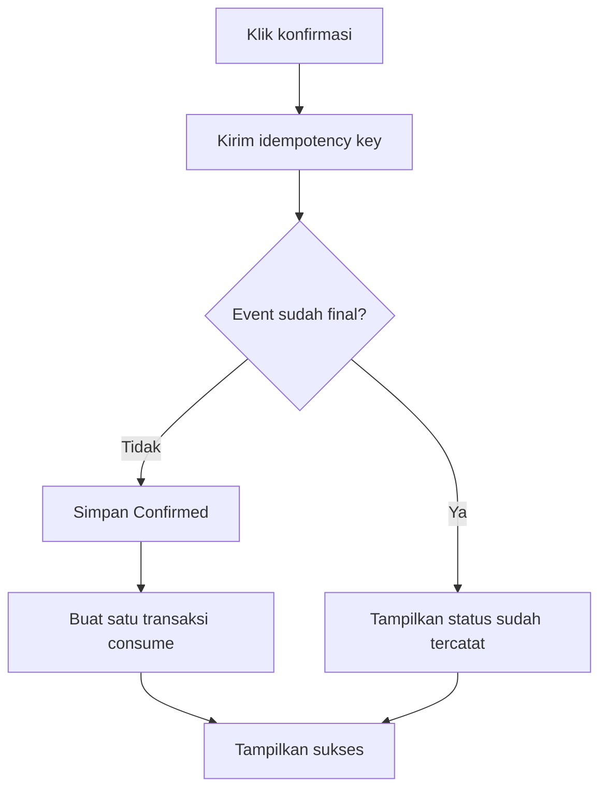

### Copy keselamatan

Jika waktu telah jauh lewat atau pengguna memilih “Saya tidak yakin”:

> Jangan mengambil dosis tambahan untuk mengganti jadwal yang terlewat kecuali sesuai petunjuk tenaga kesehatan. Periksa instruksi obat atau hubungi tenaga kesehatan atau orang yang Anda percaya.

## 10. WF-W06 — Eskalasi caregiver opsional dari web

Workflow ini tidak aktif pada mode pribadi default. Pengguna harus lebih dulu mengaktifkan
dukungan keluarga, mengundang caregiver, dan menyetujui aturan alert.

### Prasyarat

- Caregiver membership aktif.
- Consent alert aktif.
- Aturan memiliki batas waktu dan penerima.
- Backend mengetahui status sinkron terakhir.

### Alur utama

1. Reminder pengguna dikirim pada T0.
2. Reminder kedua dikirim setelah batas tunda.
3. Jika event tetap `Unconfirmed`, scheduler membuka `CaregiverAlert`.
4. Backend mencoba Web Push caregiver.
5. Jika push tidak aktif, backend menggunakan email atau kanal resmi yang diaktifkan.
6. Caregiver membuka `/caregiver/alerts` atau notification deep link.
7. Caregiver memilih “Saya tangani”.
8. Caregiver menghubungi pengguna.
9. Pengguna memperbarui status atau caregiver mencatat hasil sesuai izin.
10. Jika tidak ada acknowledgement sampai batas kedua, alert diteruskan ke caregiver cadangan.

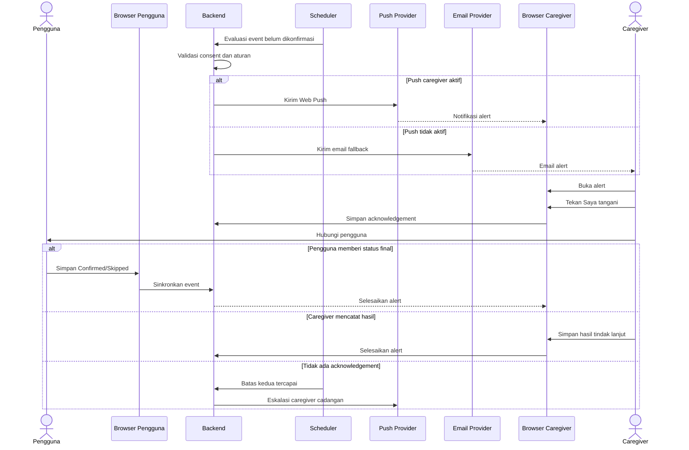

### Aturan web

- Alert tidak bergantung pada tab caregiver yang sedang terbuka.
- Jika provider tidak dapat mengantar, status delivery failure terlihat di dashboard.
- Nama obat disembunyikan bila izin detail obat tidak diberikan.
- Acknowledgement satu caregiver terlihat oleh caregiver lain.
- Status “belum tersinkron” tidak boleh langsung diperlakukan sebagai dosis terlewat.

## 11. WF-W07 — Caregiver dashboard opsional

Dashboard ini merupakan ekspansi setelah core pribadi stabil dan tidak muncul pada navigasi
pengguna yang belum mengaktifkan dukungan keluarga.

### Loading dashboard

1. Caregiver login.
2. Backend mengembalikan profil yang diizinkan dan cursor pagination.
3. UI memuat ringkasan terlebih dahulu.
4. Alert aktif dimuat sebelum riwayat panjang.
5. Foto dimuat lazy setelah daftar status terlihat.
6. Age of data ditampilkan pada setiap profil.

### Prioritas tampilan

1. Alert belum diakui.
2. Status “tidak yakin”.
3. Alert diakui tetapi belum selesai.
4. Stok rendah.
5. Ringkasan rutin.

Prioritas ini adalah prioritas workflow aplikasi, bukan klasifikasi urgensi medis.

### Tindakan caregiver

- Akui alert.
- Hubungi pengguna.
- Lihat detail sesuai izin.
- Catat hasil.
- Tandai selesai.
- Minta pengelola mengubah izin.
- Buka riwayat.
- Buka stok/refill.

## 12. WF-W08 — Stok dan refill

### Alur pengurangan stok

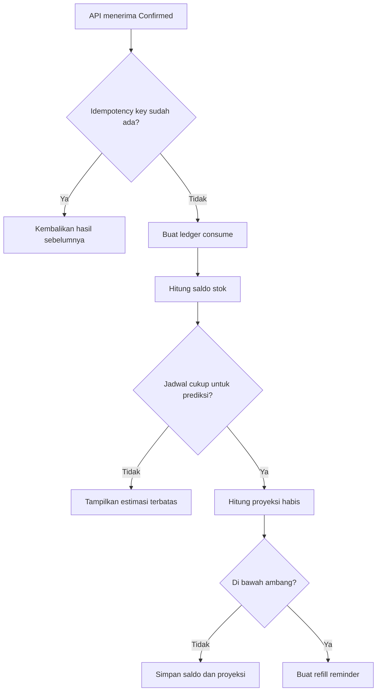

### Alur refill

1. Pengguna membuka alert stok rendah.
2. Pilih “Sudah membeli/menebus”, “Ingatkan lagi”, “Minta bantuan” bila dukungan keluarga aktif, atau “Koreksi stok”.
3. Jika refill, masukkan jumlah, unit, dan tanggal.
4. Backend membuat ledger `add`.
5. Sistem menghitung ulang proyeksi.
6. Alert ditutup jika saldo melewati ambang.

### Aturan

- Dosis dikonfirmasi menghasilkan satu transaksi konsumsi.
- Dosis dilewati, belum dikonfirmasi, atau tidak yakin tidak mengurangi stok.
- Koreksi stok membuat transaksi baru dengan alasan.
- Perubahan jadwal mengubah proyeksi, bukan saldo fisik.
- Obat bila diperlukan menampilkan estimasi terbatas jika pola penggunaan belum cukup.

## 13. WF-W09 — Undangan dan izin caregiver opsional

Alur ini dimulai dari Pengaturan hanya jika pemilik profil memilih mengaktifkan dukungan
keluarga. Tidak ada undangan otomatis dan tidak ada data yang dibagikan secara default.

### Alur utama

1. Pemilik profil membuka `/care-circle`.
2. Pilih “Undang caregiver”.
3. Pilih profil, peran, detail yang boleh dilihat, dan kanal alert.
4. Backend membuat token sekali pakai.
5. Pengguna membagikan link undangan.
6. Caregiver membuka `/invite/:token`.
7. Backend memvalidasi token dan menampilkan ringkasan izin.
8. Caregiver login/daftar.
9. Caregiver menerima atau menolak.
10. Backend mengaktifkan membership bila diterima.
11. Semua pihak melihat status keanggotaan.

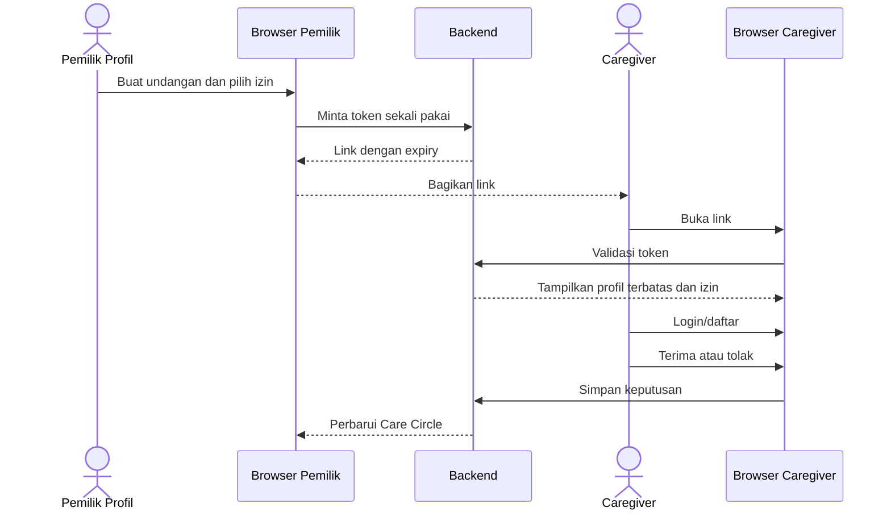

### Matriks izin

| Kemampuan                    |  Pemilik |       Pengelola |            Caregiver |       Pemantau |
| ---------------------------- | -------: | --------------: | -------------------: | -------------: |
| Melihat status hari ini      |       Ya |              Ya |          Sesuai izin |    Sesuai izin |
| Melihat nama/detail obat     |       Ya | Sesuai delegasi |             Opsional |       Opsional |
| Mengubah obat/jadwal         |       Ya |        Opsional | Tidak secara default |          Tidak |
| Mengubah stok                |       Ya |        Opsional |             Opsional |          Tidak |
| Menerima alert               | Opsional |        Opsional |                   Ya |       Opsional |
| Mengakui/menyelesaikan alert |       Ya |              Ya |                   Ya |          Tidak |
| Mengundang anggota           |       Ya |        Opsional |                Tidak |          Tidak |
| Mencabut akses               |       Ya |        Opsional |       Keluar sendiri | Keluar sendiri |

### Pencabutan

- Backend mencabut membership dan push subscription terkait.
- Route caregiver mengembalikan 403 pada request berikutnya.
- Cache lokal sensitif dibersihkan saat aplikasi berikutnya terbuka dan saat storage dapat diakses.
- Riwayat tindakan caregiver tetap ada pada audit log.

## 14. WF-W10 — Offline, multi-tab, dan sinkronisasi

### Alur offline

1. Browser kehilangan koneksi.
2. React menampilkan offline banner yang tidak menutupi CTA utama.
3. Pengguna dapat membuka app shell dan data cache yang diizinkan.
4. Pengguna mencatat event dosis.
5. Event disimpan di IndexedDB dengan `pending` status.
6. UI menampilkan “Menunggu sinkronisasi”.
7. Saat online, event dimasukkan ke retry queue.
8. Backend menerima event dengan idempotency key.
9. Jika berhasil, UI menampilkan “Tersinkron”.
10. Jika konflik, UI menampilkan “Perlu ditinjau”.

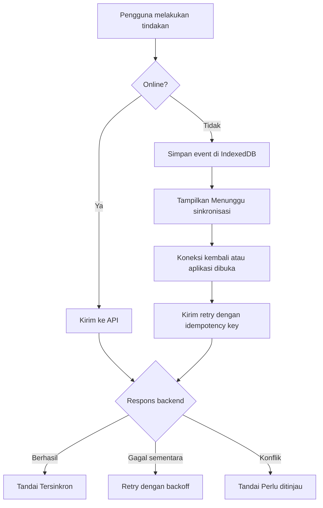

### Multi-tab

- Setiap tab membaca versi event dari backend ketika membuka detail.
- BroadcastChannel atau mekanisme setara dapat memberi tahu tab lain bahwa status berubah.
- Jika tab tidak mendukung mekanisme tersebut, polling ringan dilakukan saat layar aktif.
- Stok tidak dihitung hanya dari state React lokal.
- Satu event dosis tidak boleh menghasilkan dua ledger transaction.

### Konflik event

Jika satu tab mencatat `Confirmed` dan tab lain mencatat `Skipped` sebelum sinkronisasi:

1. Kedua event disimpan.
2. Backend tidak menghapus event pertama.
3. UI menandai event sebagai `NeedsReview`.
4. Pemilik/pengelola memilih status final.
5. Sistem membuat event koreksi.
6. Ledger stok diperbarui hanya sesuai status final.

## 15. WF-W11 — Perubahan jadwal dan rekonsiliasi

### Alur perubahan

1. Pengguna/pengelola membuka detail obat.
2. Pilih “Ubah jadwal”, “Jeda”, “Selesaikan”, atau “Hentikan”.
3. Sistem menampilkan versi jadwal lama dan baru.
4. Pengguna memilih tanggal mulai perubahan.
5. Sistem meminta alasan.
6. Backend membatalkan kejadian masa depan yang terdampak.
7. Backend membentuk kejadian baru.
8. Alert yang tidak lagi berlaku ditutup.
9. Caregiver menerima ringkasan jika diizinkan.
10. Jadwal lama dan audit tetap dapat dilihat pada riwayat.

### Konflik perubahan

- Backend menggunakan optimistic concurrency/version number.
- Request dengan versi lama ditolak sebagai conflict, bukan diam-diam ditimpa.
- UI menawarkan refresh, bandingkan, atau gunakan versi terbaru.
- Kejadian masa lalu immutable.

## 16. WF-W12 — Notifikasi, privacy, dan copy

### Pengguna obat

Lock screen default:

> Waktunya memeriksa jadwal OBTARA.

Setelah halaman dibuka:

> Jadwal pukul 08.00 — periksa foto, nama, dan dosis sebelum mengonfirmasi.

### Caregiver tanpa izin detail

> Jadwal obat profil Anda belum dikonfirmasi. Periksa status terbaru.

### Caregiver dengan izin detail

> Jadwal pukul 08.00 untuk [nama obat] belum dikonfirmasi.

### Stok

> Persediaan obat diperkirakan menipis. Periksa stok fisik.

### Aturan privacy

- Nama obat tidak masuk lock screen secara default.
- Catatan efek samping tidak masuk push.
- Diagnosis tidak masuk push.
- Preview notifikasi dapat diatur menjadi lengkap, terbatas, atau tanpa preview.
- URL notifikasi tidak menyimpan nama obat atau detail kesehatan dalam query string.

## 17. Edge cases web

| Kasus                              | Perilaku                                                                   |
| ---------------------------------- | -------------------------------------------------------------------------- |
| Pengguna menolak push              | Core flow tetap aktif; tampilkan fallback kanal dan in-app reminder        |
| Service worker gagal terdaftar     | Set capability `BrowserOnly`, jangan paksa install                         |
| Push subscription expired          | Hapus subscription, tampilkan status perlu diaktifkan kembali              |
| Tab tidak terbuka                  | Backend tetap membuat alert; delivery bergantung kanal aktif               |
| Browser sleep/OS membatasi worker  | Tandai delivery tidak terjamin dan gunakan fallback bila tersedia          |
| Ponsel mati saat jadwal            | Jangan menyatakan dosis pasti terlewat; status menunggu konfirmasi         |
| Browser private mode               | Deteksi storage terbatas dan jelaskan risiko offline                       |
| Kamera ditolak                     | Gunakan upload file atau lewati foto                                       |
| File foto terlalu besar            | Kompres atau minta file lain tanpa menghapus form                          |
| Network putus saat upload          | Tampilkan retry dan simpan draft metadata                                  |
| Refresh di route internal          | Hosting mengembalikan SPA entry point                                      |
| Asset/service worker stale         | Tampilkan update prompt setelah versi baru siap                            |
| Dua tab mengubah dosis             | Gunakan version check dan idempotency                                      |
| Zona waktu berubah                 | Minta pilihan mempertahankan waktu lokal atau waktu asal                   |
| Caregiver hilang akses             | Route dan API menolak request berikutnya; cache dibersihkan saat tersedia  |
| Push gagal tetapi email berhasil   | Tampilkan kanal berhasil dan kanal gagal di audit                          |
| Semua kanal gagal                  | Alert tetap terlihat di dashboard saat caregiver membuka web               |
| Stok nol tetapi dosis dikonfirmasi | Minta konfirmasi dan tawarkan koreksi stok                                 |
| Pengguna menghapus akun            | Cabut sessions, memberships, subscriptions, dan jalankan kebijakan retensi |

## 18. Event analitik minimum

Event analitik menggunakan identifier pseudonim dan tidak memuat nama obat, foto, atau catatan bebas.

| Event                             | Properti aman                                        |
| --------------------------------- | ---------------------------------------------------- |
| `web_capability_checked`          | browser family, capability bucket                    |
| `service_worker_registered`       | hasil registrasi                                     |
| `install_prompt_seen`             | tersedia/tidak tersedia                              |
| `install_prompt_accepted`         | hasil                                                |
| `notification_permission_changed` | granted/denied/default                               |
| `push_subscription_changed`       | created/expired/removed                              |
| `onboarding_completed`            | tipe profil, accessibility mode                      |
| `medication_created`              | ada foto, tipe jadwal, stok aktif                    |
| `photo_upload_completed`          | sumber kamera/file, ukuran bucket                    |
| `dose_reminder_scheduled`         | kanal bucket                                         |
| `dose_notification_delivered`     | kanal, success/failure                               |
| `dose_action_recorded`            | tipe tindakan, tepat waktu/terlambat, online/offline |
| `caregiver_alert_sent`            | tahap eskalasi, kanal bucket                         |
| `caregiver_alert_acknowledged`    | waktu menuju acknowledgement                         |
| `stock_threshold_reached`         | unit, hari estimasi dalam bucket                     |
| `refill_recorded`                 | sumber tindakan pengguna/caregiver                   |
| `sync_conflict_detected`          | tipe konflik, jumlah device                          |
| `spa_route_load_failed`           | route bucket, error class                            |

## 19. Checklist QA workflow

### Browser dan PWA

- [ ] Core flow bisa diselesaikan tanpa instalasi.
- [ ] Service worker hanya aktif pada HTTPS atau environment yang sesuai.
- [ ] Install prompt tidak memblokir onboarding.
- [ ] SPA deep link tetap bekerja setelah refresh.
- [ ] Asset/service worker dapat diperbarui tanpa cache stale kritis.
- [ ] Browser tanpa Push tetap punya fallback.

### Foto dan kabinet

- [ ] Upload file dan kamera browser sama-sama memiliki jalur.
- [ ] Camera permission ditanya setelah tindakan pengguna.
- [ ] Preview, crop, rotate, retake, retry tersedia.
- [ ] EXIF yang tidak dibutuhkan dihapus.
- [ ] Foto privat dan signed URL teruji.
- [ ] Nama/dosis tetap tampil jika foto gagal.

### Jadwal dan dosis

- [ ] Scheduler menghormati timezone.
- [ ] Klik push membuka deep link event yang tepat.
- [ ] Tunda tidak membuat event duplikat.
- [ ] Konfirmasi ganda tidak mengurangi stok dua kali.
- [ ] Konfirmasi terlambat tersimpan sebagai terlambat.
- [ ] “Tidak yakin” tidak memberi instruksi dosis tambahan.

### Caregiver

- [ ] Alert hanya dikirim jika consent dan aturan aktif.
- [ ] Alert tidak bergantung pada tab caregiver terbuka.
- [ ] Fallback kanal memiliki status delivery.
- [ ] Acknowledgement terlihat oleh caregiver lain.
- [ ] Pencabutan akses menghentikan push dan akses API.
- [ ] Detail obat mengikuti izin.

### Offline dan multi-device

- [ ] Event offline masuk IndexedDB.
- [ ] Retry menggunakan idempotency key.
- [ ] UI membedakan pending sync dan unconfirmed dose.
- [ ] Konflik ditandai, bukan ditimpa.
- [ ] Multi-tab tidak membuat ledger ganda.

### Stok

- [ ] Saldo sesuai ledger.
- [ ] Refill menghitung ulang proyeksi.
- [ ] Koreksi memiliki alasan dan audit.
- [ ] Perubahan jadwal tidak mengubah saldo fisik.
- [ ] Stok negatif membutuhkan konfirmasi.

### Aksesibilitas dan keamanan

- [ ] Alur utama dapat dijalankan dengan keyboard.
- [ ] Focus ring terlihat.
- [ ] Modal dapat ditutup dengan Escape.
- [ ] Zoom 200% tidak merusak fungsi utama.
- [ ] Screen reader membaca status obat.
- [ ] Lock screen tidak membocorkan nama obat secara default.
- [ ] Data privat tidak muncul di URL, log, CDN publik, atau cache publik.

## 20. Ringkasan alur MVP web

OBTARA Web mengikuti siklus:

1. **Masuk untuk saya:** buka dari browser, buat profil pribadi, atau instal sebagai PWA bila tersedia.
2. **Tata:** masukkan obat, foto, jadwal, dan stok milik sendiri.
3. **Ingatkan:** backend menjadwalkan reminder dan browser menampilkan kanal yang tersedia.
4. **Konfirmasi:** pengguna memberi status yang jujur dan aman.
5. **Sediakan:** stok dihitung dan refill diingatkan.
6. **Sinkronkan:** event antar-browser dan device direkonsiliasi.
7. **Pelajari:** riwayat membantu pengguna melihat pola pribadinya.
8. **Bagikan bila dipilih:** caregiver dapat diundang dan menerima alert hanya setelah dukungan keluarga serta consent diaktifkan.

Kompleksitas browser capability, scheduler, retry, audit, dan caregiver berada di belakang
layar; pengguna pribadi tetap melihat alur yang ringkas dan tidak diwajibkan berbagi data.
